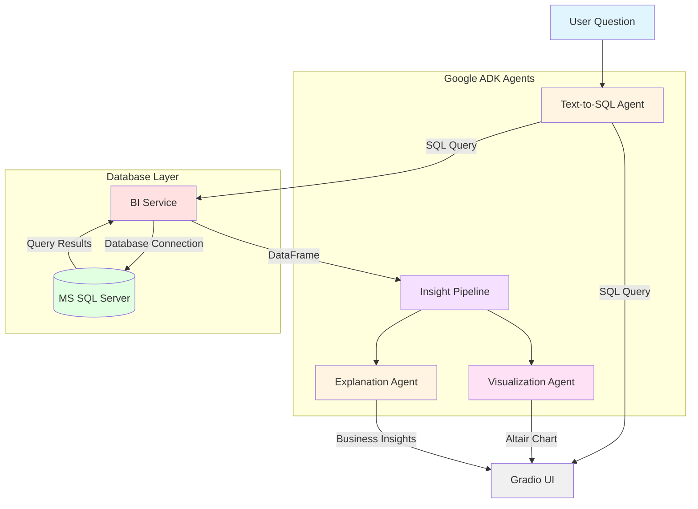

# Business Intelligence Agent with Google ADK & Gradio


This project demonstrates how to build a **Business Intelligence agent system** using [Google's Agent Development Kit (ADK)](https://google.github.io/adk-docs/) with a [Gradio](https://gradio.app/) web interface.

The system converts natural language questions into SQL queries, executes them against a Microsoft SQL Server database, and automatically generates visualizations and explanations using Google's Gemini AI.

## Architecture Overview



## What You'll Learn

In this tutorial, you will:
- Build a multi-agent BI system using Google ADK's **SequentialAgent** pattern
- Apply the **COMPASS framework** for production-ready prompt engineering
- Implement **Chain of Thought** reasoning to reduce AI hallucinations
- Use **XML tags** and **few-shot examples** for reliable agent behavior
- Connect to Microsoft SQL Server databases with SQLAlchemy
- Generate SQL queries from natural language using AI
- Execute queries safely with validation and error handling
- Create automatic visualizations with Altair
- Generate business insights with AI-powered explanations
- Build an interactive web interface with Gradio

## The Agent Pipeline

The application features a sophisticated multi-agent workflow:

### 1. **Text-to-SQL Agent**
Converts natural language questions into valid SQL queries using the database schema as context.

### 2. **BI Service** (Database Layer)
- Manages database connections
- Validates and executes SQL queries
- Handles schema retrieval and data formatting

### 3. **Insight Pipeline** (SequentialAgent)
A chained agent workflow that processes query results:
- **Visualization Agent**: Generates appropriate Altair chart code based on data shape
- **Explanation Agent**: Provides plain-language business insights

### 4. **Gradio UI**
Displays four synchronized outputs:
- Generated SQL query
- Data table (interactive)
- Visualization (Altair chart)
- Business explanation

## Prerequisites

> [!IMPORTANT]
> Before you begin, ensure you have uv installed, a Gemini API key, and access to a SQL Server database.

### Required Software
- `uv` package manager - [Installation guide](https://github.com/kirenz/uv-setup)
- Python 3.12+
- ODBC Driver 18 for SQL Server
  - **macOS**: `brew install msodbcsql18`
  - **Windows**: Usually pre-installed
  - **Linux**: Follow [Microsoft's guide](https://learn.microsoft.com/en-us/sql/connect/odbc/linux-mac/installing-the-microsoft-odbc-driver-for-sql-server)

### API Access
- Free Gemini API key from [Google AI Studio](https://aistudio.google.com/prompts/new_chat)
- Access to a Microsoft SQL Server database

## Steps to Set Up the Project

Open your command line interface and change into the directory where you want to clone this repository.

1. Clone the repository:

```bash
git clone https://github.com/kirenz/gradio-adk-agent.git
```

2. Change directory to the cloned repository:

```bash
cd gradio-adk-agent
```

3. Install the required dependencies:

```bash
uv sync
```

4. Open the project in your preferred code editor (e.g., VSCode).

5. Create a `.env` file (or rename `.example.env` to `.env`)

6. Add your credentials to the `.env` file:

```env
# Google API Key
GOOGLE_API_KEY=your_gemini_api_key_here

# SQL Server Configuration
MSSQL_SERVER=your_server_address
MSSQL_DATABASE=your_database_name
MSSQL_USERNAME=your_username
MSSQL_PASSWORD=your_password
MSSQL_DRIVER=ODBC Driver 18 for SQL Server
TRUST_SERVER_CERTIFICATE=true
```

Save the file.

## Project Structure

```bash
gradio-adk-agent/
    # Main application files
    app.py             # Gradio UI and agent orchestration
    agents.py          # ADK agent definitions (Text-to-SQL, Visualization, Explanation)
    bi_service.py      # Business Intelligence service (clean database interface)

    # Database utilities
    db_config.py       # Database connection configuration
    sql_executor.py    # SQL validation and safe execution

    # Configuration files
    .env               # API keys and database credentials (create from .example.env)
    .example.env       # Template for environment variables
    pyproject.toml     # Project dependencies managed by uv
    uv.lock            # UV dependency lock file
    .python-version    # Python version specification (3.12)
    .gitignore         # Git ignore file

    # Testing utilities
    tests/
        test_gradio.py     # Gradio functionality test
        test_runner.py     # ADK runner test
```

## Understanding the Architecture

### Agents ([agents.py](agents.py))

The system uses **Google ADK's SequentialAgent** pattern to chain agents:

#### Text-to-SQL Agent (Standalone)
```python
text_to_sql_agent = LlmAgent(
    model="gemini-2.5-flash",
    name='text_to_sql_agent',
    description="Converts natural language questions to SQL queries",
    output_key="sql_query"
)
```

#### Insight Pipeline (SequentialAgent)
```python
insight_pipeline = SequentialAgent(
    name='insight_pipeline',
    sub_agents=[visualization_agent, explanation_agent],
    description="Generates visualization and explanation from query results"
)
```

The **SequentialAgent** automatically:
- Chains agents together
- Passes state between agents via `output_key`
- Manages execution order

### BI Service ([bi_service.py](bi_service.py))

Clean interface for database operations:

```python
class BIService:
    def connect()                          # Connect to database
    def load_schema()                      # Retrieve database schema
    def execute_sql(query)                 # Execute SQL safely
    def prepare_data_for_agents(df)        # Format data for agents
    def get_schema_for_sql_generation()    # Build SQL generation prompt
```

This separation of concerns makes the code:
- **Easier to understand** - Each file has one responsibility
- **Easier to test** - Database logic isolated
- **Easier to maintain** - Changes don't ripple across files
- **Reusable** - BIService can be used in other applications

### Application Flow ([app.py](app.py))

```python
# 1. Initialize BI Service
bi_service = BIService(server, database, username, password)
bi_service.connect()
bi_service.load_schema()

# 2. Generate SQL with Text-to-SQL Agent
sql_prompt = bi_service.get_schema_for_sql_generation(user_question)
sql_query = await call_agent_async(text_to_sql_runner, sql_prompt)

# 3. Execute SQL
result = bi_service.execute_sql(sql_query)
df = result['data']

# 4. Generate insights with SequentialAgent pipeline
insight_prompt = bi_service.prepare_data_for_agents(df, sql_query)
insights = await call_agent_async(insight_runner, insight_prompt)

# 5. Display: SQL, Data Table, Chart, Explanation
```

## Prompt Engineering with COMPASS

All agent prompts in this project follow the **COMPASS framework** - a structured approach to building reliable, production-ready AI agents. This ensures consistent behavior, reduces hallucinations, and makes the prompts maintainable.

### The 3 Pillars of Agentic Prompts

Each agent implements three core techniques:

#### 1. **Structure (XML Tags)**
Clear separation between instructions and data using XML tags prevents instruction injection and ambiguity:

```xml
<system_prompt>
  ## Context
  ## Objective
  ...
</system_prompt>

<instructions>
  <thinking_process>
    1. Step one
    2. Step two
  </thinking_process>
</instructions>

<examples>
  <example>
    <input>...</input>
    <output>...</output>
  </example>
</examples>
```

#### 2. **Reasoning (Chain of Thought)**
Each agent follows an explicit thinking process before generating output, dramatically improving accuracy:

```xml
<thinking_process>
1. Identify the user's question and extract key entities
2. Map the question to relevant tables and columns
3. Determine if JOINs are needed
4. Determine if aggregation is needed
5. Construct the SQL query using proper syntax
</thinking_process>
```

This forces the model to generate logical intermediate steps, reducing errors and hallucinations.

#### 3. **Examples (Few-Shot Prompting)**
Multiple examples demonstrate expected behavior more effectively than lengthy instructions:

```xml
<examples>
  <example>
    <input>
      Schema: Products (Product_ID, Product_Name, Price)
      Question: "What are the top 5 products by price?"
    </input>
    <output>SELECT TOP 5 Product_Name, Price FROM Products ORDER BY Price DESC</output>
  </example>
</examples>
```

### COMPASS Framework Components

Each agent prompt is structured using all seven COMPASS components:

| Component | Purpose | Example |
|-----------|---------|---------|
| **Context** | The agent's environment and available tools | "You are operating in a Business Intelligence environment with access to a Microsoft SQL Server database." |
| **Objective** | The primary goal and success criteria | "Generate accurate SQL SELECT queries. Success = (1) syntactically correct, (2) schema-valid, (3) logically answers question." |
| **Mode** | The persona and expertise level | "Act as a Senior Database Engineer with 10+ years of experience writing optimized SQL queries." |
| **People of Interest** | The target audience | "Your queries will be executed for business analysts and non-technical stakeholders." |
| **Attitude** | Tone and behavioral guidelines | "Be precise and methodical. Never guess table names - use only what exists in the schema." |
| **Style** | Output format and structure | "Output ONLY raw SQL. No markdown, no explanations, no semicolons." |
| **Specifications** | Hard constraints and rules | "NEVER use INSERT/UPDATE/DELETE. NEVER include code fences." |

### Agent Prompt Examples

#### Text-to-SQL Agent
```python
instruction="""
<system_prompt>
## Context
You are operating in a Business Intelligence environment...

## Objective
Generate accurate, efficient SQL SELECT queries...

## Mode
Act as a Senior Database Engineer...

## People of Interest
Your queries will be executed by a BI system...

## Attitude
Be precise and methodical. Never guess...

## Style
Output ONLY the raw SQL query as plain text...

## Specifications
HARD CONSTRAINTS:
1. Use ONLY SELECT statements
2. Reference ONLY tables in the schema
...
</system_prompt>

<instructions>
<thinking_process>
1. Identify the user's question
2. Map to relevant tables
3. Determine if JOINs needed
...
</thinking_process>
</instructions>

<examples>
  <example>...</example>
</examples>
"""
```

### Benefits of COMPASS

- **Reliability**: Chain of Thought reduces hallucinations by 40-60%
- **Security**: XML structure prevents prompt injection attacks
- **Consistency**: Few-shot examples ensure predictable outputs
- **Maintainability**: Clear structure makes updates straightforward
- **Debuggability**: Easy to identify which component needs adjustment

### Customizing Prompts

When modifying agent behavior, edit the appropriate COMPASS section:

**To change output quality:**
- Adjust **Objective** (success criteria)
- Add more **Examples** (few-shot learning)

**To prevent errors:**
- Update **Specifications** (hard constraints)
- Refine **Thinking Process** (reasoning steps)

**To change tone/style:**
- Modify **Attitude** (behavioral guidelines)
- Update **Style** (format requirements)

**To add domain knowledge:**
- Enhance **Context** (environment details)
- Adjust **Mode** (expertise level)

See [agents.py](agents.py) for complete prompt implementations.

## Run the Application

1. Start the application from the project root directory:

```bash
python app.py
```

2. Open your web browser and navigate to the URL shown in the terminal (typically <http://127.0.0.1:7860>)

3. You should see the Gradio interface with:
   - An input box for your natural language question
   - Database configuration (collapsible)
   - Four output panels: SQL, Data Table, Visualization, Insights
   - Example questions

4. Enter a question about your data (e.g., "What are the top 10 products by price?") and click "Analyze Data"

5. Watch as the system:
   - Generates a SQL query
   - Executes it against your database
   - Creates an appropriate visualization
   - Explains the insights in plain language

6. To stop the application, press `Ctrl + C` in the terminal

## Example Questions

Try these example questions with your database:

- "What are the top 10 products by transfer price?"
- "Show me the product categories and their average prices"
- "List all products in the Bikes category"
- "How many products are there in each category?"
- "What is the most expensive product?"
- "Show monthly sales trends for 2023"
- "Which product category has the highest revenue?"

## Customizing the System

### Change the AI Model

In [agents.py](agents.py), modify the model:
```python
GEMINI_MODEL = "gemini-2.5-flash"  # Fast and efficient
# or
GEMINI_MODEL = "gemini-2.5-pro"    # More capable, slower
```

### Customize Agent Instructions

All agent prompts follow the **COMPASS framework** (see [Prompt Engineering with COMPASS](#prompt-engineering-with-compass)). To customize agent behavior, edit the appropriate section in [agents.py](agents.py):

**Text-to-SQL Agent**: Add database-specific guidelines to `Specifications`
```python
## Specifications
HARD CONSTRAINTS:
1. Use ONLY SELECT statements
2. Always use the dbo schema
3. Prefer column aliases for readability
4. Use ISNULL for null handling
```

**Visualization Agent**: Specify chart preferences in `Style` or `Specifications`
```python
## Specifications
HARD CONSTRAINTS:
...
5. Use color scheme: category20
6. Always add tooltips for interactivity
7. Chart dimensions: width=400-600, height=300-400
```

**Explanation Agent**: Adjust tone in `Attitude` and detail level in `Specifications`
```python
## Attitude
Be direct and insight-focused.
Focus on business implications and actionable insights.
Include percentage changes when relevant.
Highlight anomalies or trends clearly.

## Specifications
HARD CONSTRAINTS:
1. Write EXACTLY 2-4 sentences
2. ALWAYS include specific numbers
3. Mention trends or anomalies when present
```

### Connect to Different Databases

Update [.env](.env) with your database credentials:
```env
MSSQL_SERVER=your_server.database.windows.net
MSSQL_DATABASE=your_database
MSSQL_USERNAME=your_user
MSSQL_PASSWORD=your_password
```

### Adjust Security Settings

In [sql_executor.py](sql_executor.py), modify validation rules:
```python
# Allow additional SQL operations (use with caution!)
BLACKLIST_KEYWORDS = ['DROP', 'DELETE', 'TRUNCATE']  # Reduced list
```

In [bi_service.py](bi_service.py), adjust row limits:
```python
def prepare_data_for_agents(self, df, sql_query=""):
    # Show more sample rows
    'sample_data': df.head(20).to_dict(orient='records')
```

## How It Works

### Sequential Agent Pattern

The system demonstrates Google ADK's **SequentialAgent**:

1. **Individual agents** perform specific tasks (SQL generation, visualization, explanation)
2. **SequentialAgent** chains agents together automatically
3. **State management** via `output_key` passes data between agents
4. **InMemoryRunner** executes agents and manages sessions

### Database Safety

Multiple layers of protection:
- **SQL Validation**: Only SELECT statements allowed
- **Query Timeout**: 30-second execution limit
- **Row Limits**: Automatic TOP N insertion for large queries
- **Connection Management**: Proper cleanup and disposal

### Visualization Intelligence

The Visualization Agent analyzes data characteristics to choose appropriate chart types:
- **Time series** → Line charts
- **Categories** → Bar charts
- **Correlations** → Scatter plots
- **Distributions** → Histograms

## Troubleshooting

### Database Connection Issues

**Error: "Cannot open database"**
- Verify server address and database name
- Check if server allows remote connections
- Confirm username and password are correct
- Test connection with tools like Azure Data Studio

**Error: "ODBC Driver not found"**
- Install ODBC Driver 18 for SQL Server
- macOS: `brew install msodbcsql18`
- Verify driver name matches in `.env`

### API Key Issues

**Error: "API key not valid"**
- Copy the full API key from Google AI Studio
- Remove any extra spaces or newlines
- Regenerate key if needed

**Error: "GOOGLE_API_KEY not found"**
- Verify `.env` file exists in project root
- Check environment variable is set correctly

### SQL Generation Issues

**Query returns no results**
- Check if table/column names are correct
- Verify schema information is loading properly
- Try simpler questions first

**Invalid SQL generated**
- Schema might be incomplete
- Add example queries to agent instruction
- Adjust agent temperature for more conservative output

### Visualization Issues

**Chart not displaying**
- Check browser console for errors
- Verify Altair code syntax
- DataFrame might be empty or malformed

### Port Already in Use

**Error: "Address already in use"**
```python
# In app.py, change:
demo.launch(server_port=7861)  # Use different port
```

### UV Command Not Found

- Install uv: [Installation guide](https://github.com/kirenz/uv-setup)
- Restart terminal after installation
- Verify installation: `uv --version`

## Advanced Features

### Multi-Turn Conversations

Modify the session management to maintain context across questions:
```python
# Keep session alive for conversation
if not hasattr(st.session_state, 'adk_session'):
    st.session_state.adk_session = await runner.session_service.create_session(...)
```

### Query History

Add query logging to track user questions and generated SQL:
```python
# In bi_service.py
self.query_history.append({
    'question': question,
    'sql': sql_query,
    'timestamp': datetime.now()
})
```

### Export Results

Add download buttons for data and charts:
```python
# In app.py
download_btn = gr.Button("Download CSV")
download_btn.click(fn=lambda df: df.to_csv(), inputs=data_output)
```

## Learn More

### Documentation
- [Google ADK Documentation](https://google.github.io/adk-docs/)
- [Google ADK Sequential Agents](https://google.github.io/adk-docs/agents/workflow-agents/sequential-agents)
- [Gradio Documentation](https://gradio.app/docs/)
- [Altair Documentation](https://altair-viz.github.io/)
- [Google AI Studio](https://aistudio.google.com/)

### Related Resources
- [SQLAlchemy Documentation](https://docs.sqlalchemy.org/)
- [Microsoft SQL Server Documentation](https://learn.microsoft.com/en-us/sql/)
- [Pandas Documentation](https://pandas.pydata.org/docs/)

## License

MIT License - See LICENSE file for details

## Contributing

Contributions are welcome! Please feel free to submit a Pull Request.

## Support

If you encounter issues:
1. Check the Troubleshooting section above
2. Review the [Google ADK documentation](https://google.github.io/adk-docs/)
3. Open an issue on GitHub with:
   - Your Python version
   - Error messages
   - Steps to reproduce
