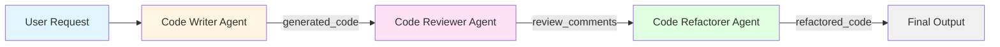

# Google Agent Development Kit (ADK) with Gradio UI


This project demonstrates how to build a sequential agent pipeline using [Google's Agent Development Kit (ADK)](https://google.github.io/adk-docs/) with a user-friendly [Gradio](https://gradio.app/) web interface. 

The pipeline consists of three specialized agents that work together to generate, review, and refactor Python code based on user requests.




## What You'll Learn

In this tutorial, you will:
- Set up a multi-agent pipeline using Google ADK
- Create three specialized agents that work sequentially
- Build an interactive web interface with Gradio
- Handle asynchronous agent communication
- Process and display outputs from multiple agents
- Understand state management in agent pipelines

## The Agent Pipeline

The application features three specialized agents working in sequence:

1. **Code Writer Agent** - Generates initial Python code based on user requirements
2. **Code Reviewer Agent** - Reviews the generated code and provides constructive feedback
3. **Code Refactorer Agent** - Improves the code based on review comments

Each agent's output is displayed in a separate panel, allowing you to see the evolution of your code through the pipeline.

## Prerequisites

> [!IMPORTANT]
> Before you begin, ensure you have uv installed and a Gemini API key.

- You should have `uv` installed. If you don't, follow these instructions: [uv installation guide](https://github.com/kirenz/uv-setup).

- You need a free Gemini API key. Create a key in [Google AI Studio](https://aistudio.google.com/prompts/new_chat) if you haven't already.

## Steps to Set Up the Project

Open your command line interface and change into the directory where you want to clone this repository.

Then run the following commands:

1. Clone the repository:

```bash
git clone https://github.com/kirenz/gradio-adk-agent.git
```

2. Change directory to the cloned repository:

```bash
cd gradio-adk-agent
```

3. Install the required dependencies:

```bash
uv sync
```

4. Open the project in your preferred code editor (e.g., VSCode).

5. Rename the `.example.env` file to `.env` (if it doesn't exist yet, create a `.env` file)

6. Open the `.env` file and add your Google API key:

```
GOOGLE_API_KEY=your_api_key_here
```

Save the file.

## Explore the Agent Project

### Project Structure

The project has the following structure:

```bash
gradio-adk-agent/
    # Main application files
    agents.py          # Agent definitions and pipeline configuration
    app.py             # Gradio web interface for the three-agent pipeline

    # Testing and debugging utilities
    debug_async.py     # Debug script for async event processing
    debug_events.py    # Debug script for synchronous event inspection
    test_gradio.py     # Simple Gradio functionality test
    test_runner.py     # ADK runner setup test

    # Configuration files
    .env               # API keys (not tracked in git, create from .example.env)
    .example.env       # Template for environment variables
    pyproject.toml     # Project dependencies managed by uv
    uv.lock            # UV dependency lock file
    .python-version    # Python version specification (3.12)
    .gitignore         # Git ignore file
```

### Understanding the Agents

Open the [agents.py](agents.py) file to see how the three agents are defined:

#### 1. Code Writer Agent
```python
code_writer_agent = LlmAgent(
    model=GEMINI_MODEL,
    name='code_writer_agent',
    description="You write Python code.",
    instruction="...",
    output_key="generated_code"
)
```
This agent generates Python code based on user requests and stores it in the `generated_code` state variable.

#### 2. Code Reviewer Agent
```python
code_reviewer_agent = LlmAgent(
    model=GEMINI_MODEL,
    name='code_reviewer_agent',
    description="You review Python code.",
    instruction="...",
    output_key="review_comments"
)
```
This agent reviews the generated code and provides feedback, storing it in `review_comments`.

#### 3. Code Refactorer Agent
```python
code_refactorer_agent = LlmAgent(
    model=GEMINI_MODEL,
    name='code_refactorer_agent',
    description="You refactor Python code based on review comments.",
    instruction="...",
    output_key="refactored_code"
)
```
This agent refactors the code based on the review comments and stores the result in `refactored_code`.

#### Sequential Agent Pipeline
```python
root_agent = SequentialAgent(
    name='code_pipeline_agent',
    sub_agents=[code_writer_agent, code_reviewer_agent, code_refactorer_agent],
    description="Executes a sequence of agents"
)
```
The `SequentialAgent` orchestrates the three agents, ensuring they execute in order with state passed between them.

### Understanding the Gradio Interface

Open the [app.py](app.py) file to see how the Gradio interface is built:

- **User Input**: A text box where users describe what code they want
- **Three Output Panels**: Display the output from each agent
- **Process Flow**: The `process_request_async` function handles the agent pipeline execution
- **State Management**: Agent outputs are extracted from the `state_delta` in events


## Run the Application

1. Open the integrated terminal in your code editor or use your command line interface, and run the following command from the project root directory:

```bash
uv run python app.py
```

2. Open your web browser and navigate to the URL shown in the terminal (typically <http://127.0.0.1:7860>) to access the application.

3. You should see the Gradio interface with:
   - An input box for your code request
   - Three output panels (one for each agent)
   - Example prompts you can try

4. Enter a description of what you want to code (e.g., "Write a function to calculate fibonacci numbers") and click "Start Pipeline".

5. Watch as each agent processes your request in sequence:
   - First, the Code Writer generates the initial code
   - Then, the Code Reviewer provides feedback
   - Finally, the Code Refactorer improves the code

6. To stop the application, go back to your terminal and press `Ctrl + C`.

## Example Use Cases

Try these example requests to see the pipeline in action:

- "Write a function to calculate fibonacci numbers"
- "Create a class for a simple bank account with deposit and withdraw methods"
- "Write a function to check if a string is a palindrome"
- "Create a function to sort a list using quicksort algorithm"

## Customizing the Agents

You can customize the agents by modifying their properties in `agents.py`:

### Change the Model
```python
GEMINI_MODEL = "gemini-2.5-flash"  
```

### Modify Agent Instructions
Edit the `instruction` parameter to change how agents behave. For example, you could:
- Make the Code Reviewer focus on specific aspects (security, performance, etc.)
- Change the Code Writer to generate code in a specific style
- Adjust the Code Refactorer to prioritize certain improvements

### Add More Agents
You can extend the pipeline by adding more agents to the `sub_agents` list in the `SequentialAgent`.

## How It Works

### Sequential Agent Execution
The pipeline uses ADK's `SequentialAgent` to ensure agents execute in order:
1. User submits a request
2. Code Writer generates initial code (stored in `generated_code`)
3. Code Reviewer analyzes the code (stored in `review_comments`)
4. Code Refactorer improves the code (stored in `refactored_code`)

### Asynchronous Processing
The application uses async/await to handle agent execution:
- `runner.run_async()` executes the agent pipeline
- Events stream back as each agent completes
- The UI updates in real-time as outputs become available

### State Management
Agents communicate through shared state:
- Each agent writes to its `output_key`
- Subsequent agents can reference previous outputs using `{generated_code}`, `{review_comments}`, etc.
- The Gradio interface extracts these values from `state_delta` in events

## Troubleshooting

### API Key Issues
- **Error: "API key not valid"**: Make sure you copied the full API key from Google AI Studio without any extra spaces
- **Error: "GOOGLE_API_KEY not found"**: Verify that your `.env` file is in the project root directory and contains the API key

### Port Already in Use
- **Error: "Address already in use"**: Port 7860 is already occupied. Either:
  - Stop the other application using that port, or
  - Modify the launch command in `app.py`: `demo.launch(server_port=7861)`

### UV Command Not Found
- **Error: "uv: command not found"**: Make sure uv is installed. Follow the [uv installation guide](https://github.com/kirenz/uv-setup)
- After installation, you may need to restart your terminal

### Dependencies Issues
- If you encounter dependency errors, try removing the lock file and reinstalling:
  ```bash
  rm uv.lock
  uv sync
  ```

### Agent Not Responding
- Check that your internet connection is active (agents need to communicate with Google's API)
- Verify your API key has not expired or exceeded its quota
- Check the terminal for error messages

## Learn More

- [Google ADK Documentation](https://google.github.io/adk-docs/)
- [Gradio Documentation](https://gradio.app/docs/)
- [Google AI Studio](https://aistudio.google.com/)

